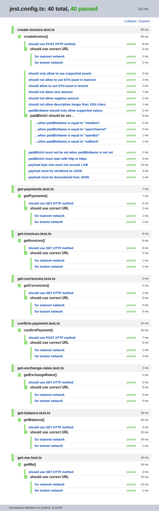

<p align="center">
  
  Cover art is a courtesy of Lolita Filipskikh specially for the <code>@crypto-pay/sdk</code>
</p>

# @crypto-pay/sdk

Node.js SDK for Telegram [CryptoBot][crypto-bot]
([CryptoPay API][crypto-pay-api]).

---

## Contest-related information

_(this section will be deleted after the contest)_

See the [Crypto Pay API Review](https://telegra.ph/Crypto-Pay-API-Review-11-28)
for notices regarding the API implementation.

---

## Features

- A **complete Node.js compatible implementation** of the entire CryptoPay API as specified in its [documentation][crypto-pay-api],

- **All LTS Node.js versions are supported** (starting from Node 12),
- **HTTP-transport agnostic:** provides implementation of the [Got HTTP](https://github.com/sindresorhus/got) client, but allows use to use any library you want thanks to the [dependency inversion principle](https://en.wikipedia.org/wiki/Dependency_inversion_principle),

- Build-in HTTP client supports **automatic time-outs**, **request retries** and **prevents server-side redirects** for security purposes,
- **Written completely in TypeScript** from scratch in a very strict manner with 100% type coverage (and no *any*'s), ensuring that the library code is correct (type safe) by itself and also **provides high quality typing declarations** to make sure that your code is also correct and type safe,
- Provides **complete interfaces, enumerations, constants and helper functions** for all the API methods, data models and all possible properties based on the API documentation and the observed API behavior. You can even use all these basic building blocks directly without the need to use any methods provided by the library!
- **Enables amazing type completion** for you IDE (even if you are not using TypeScript) thanks to the provided typing declarations,
- **Provides runtime-level safety** by **validating all the properties of your requests** to make sure that they conform to the API schema thanks to the perfect [JOI library](https://joi.dev/). Your request won't even hit a network before it's checked for type safety and validated by the API schema, you can even code and debug your code in a flight and it will be guaranteed to work when you land,
- Most of the library code is **covered by unit or functional tests**, especially the critical aspects of the API interaction,
- Library architecture is split into a **three-tier system**, you can use an abstraction layer that best suits your needs,
- All low-level data types of the API are **automatically serialized and deserialized** to a more suitable higher level types:
  - ISO:8601 date string are converted to JavaScript Date objects,
  - you can safely use any JavaScript object as a `payload` for your `Invoice`s, it will be automatically converted to and from JSON when interacting with the API, the library will even tell you if the byte length of your payload exceeds the API limits,
  - monetary values are parsed using the [decimal.js-light](https://github.com/MikeMcl/decimal.js-light) library for safety purposes,

- All the `snake_case` properties of the API data layer are **automatically converted to** `camelCase`, which is much better suited for JavaScript ecosystem and makes your code look clear and consistent,
- As a bonus, **additional helper functions** are provided on top of the API to make your workflow extremely easy and simple,
- **Minimal possible dependencies** (all are high quality ones) updated to the latest versions,
- **Source maps** for the library is generated and provided to you for easier debugging.

## Install

Install the library as well as [Got HTTP](https://github.com/sindresorhus/got) (if you are going to use it).

```shell
npm install --save @crypto-pay/sdk [got]
```


## Usage

### Three API levels

The library code is split into three tiers or three abstraction layers, they are described below.

### Top level API

This is the most simple and straightforward way to use the library and is recommended for the most users. It will abstract away all the technical details from you and will just work, letting you concentrate on your application's business logic.

**Traits:**

- `(+)` enables central configuration of all the common library options (i.e. network, token, etc), which eliminates boilerplate,
- `(—)` returns the domain data directly, doesn't provide access to the HTTP responses

**Usage example**

```typescript

import got from 'got';

import {
  ApiClient,
  CryptoCurrency,
  GotHttpClient,
  Network,
  PaidBtnName,

} from '@crypto-pay/sdk';


(async () => {
  // Create an instance of the HTTP client
  // Here, we use the built-in Got HTTP client:
  const httpClient = new GotHttpClient({ got });

  // Instantiate the API client class, your gateway
  // to interacting with the CryptoBot API
  const client = new ApiClient({

    // Pass the app token here directly or use the
    // CRYPTO_BOT_TOKEN environment variable (recommended)
    // appToken: '<token>',
    httpClient,

    // Here we are using the "testnet" network,
    // "mainnet" will be used by default
    network: Network.Testnet,

  });

  try {
    // Now, you can use any API methods that you want,
    // no further configuration is required.

    // Here, I'm going to create a new invoice.
    // The method will return a Promise that needs to be awaited for:
    const invoice = await client.createInvoice({

      // All the possible values for certain properties are provided
      // for you via helpful enumerations, no ned to guess:
      asset: CryptoCurrency.TON,

      // You can specify the "amount" in any format that you like,
      // e.g. "string", "number" or Decimal from decimal.js library,
      // it will be automatically converted to the proper format
      amount: '1.22',

      description: `A test invoice for my cool application`,
      paidBtnName: PaidBtnName.ViewItem,
      paidBtnUrl: `https://example.com`,

      // You can specify "payload" as any combination of the primitive values
      // it will be serialized and deserialized to and from the JSON string automatically
      payload: {
        // The values below are not part of the API
        // you can pass anything you want here
        // that you need to store alongside the invoice
        orderId: '123-abc',
        userId: 100500,
        shouldNotifyByEmail: true
      },

      allowAnonymous: true,
      allowComments: false,
    });

    // Now, you can work with the Invoice object
    // returned from the server as you see fit:
    console.log(JSON.stringify(invoice, null, 4));

    console.log(
      `Visit the following URL to pay for the order: ${invoice.payUrl}`
    );

  } catch (error) {
    // You should use try...catch block to work with the exceptions
    console.error(error);

  }

})();
```

You always start with instantiating the `ApiClient` class, this is your gateway to the API. You can configure all the options by using its constructor argument.

You will need to at least specify an implementation of the HTTP client. We provide one that uses Got for you out of the box, you just need to instantiate it first and pass a Got object to it. This is a dependency inversion principle in action: if you want to use another HTTP library (e.g. fetch, axios, request, etc) of even an existing instance of the HTTP library that you already use in your project, you just need to implement a simple [`HttpClient`](https://github.com/slavafomin/crypto-bot-sdk/blob/main/src/http-client/http-client.ts) interface, which is pretty [easy to do](https://github.com/slavafomin/crypto-bot-sdk/blob/main/src/http-client/got-http-client.ts). If you would like a built-in support for your favorite HTTP library just create an issue or a PR, we will look into this!

> You can find all the possible usage examples for top-level API layer in the [examples/api-client](examples/api-client) directory.

### Middle level API

This abstraction level allows you to call each API method directly without using the `ApiClient` class. It gives you a little more control and response observability.

**Traits:**

- `(+)` gives you direct access to all the API methods with the single-call functional usage style,
- `(—)` no central configuration, each API method must be configured individually leading to a repetitive code,
- `(+)` returns HTTP responses, so you have access to entire response and all the data (e.g. status codes, headers, etc).

**Usage example:**

```typescript
import got from 'got';

import {
  createInvoice,
  CryptoCurrency,
  GotHttpClient,
  Network,
  PaidBtnName,

} from '@crypto-pay/sdk';

import { appToken } from '../app-token';


(async () => {

  const httpClient = new GotHttpClient({ got });

  try {
    // You call the API method directly, no need to create ApiClient instance.
    // All the parameters are the same as privously described.
    // Response is an HTTP response object instead of the domain model object:
    const response = await createInvoice({
      appToken,
      params: {
        asset: CryptoCurrency.ETH,
        amount: 5.33,
        description: `A test invoice for my cool application`,
        paidBtnUrl: `https://example.com`,
        payload: { an: { example: { payload: ["object"] } } },
        paidBtnName: PaidBtnName.ViewItem,
        allowAnonymous: true,
        allowComments: false,
      },
      httpClient,
      network: Network.Testnet,
    });

    console.log(JSON.stringify(response.payload, null, 4));

  } catch (error) {
    console.error(error);

  }

})();
```


### Low level API

- @todo: token via env variable
- @todo: confirm paid
- @todo: decimal.js-light (https://modernweb.com/what-every-javascript-developer-should-know-about-floating-points/)

…


## Examples

You can find a whole set of various usage examples in the
[examples](./examples) directory of the library. There are
three categories of examples:

- [api-client](./examples/api-client)<br>
  Top-level API layer that is the most user-friendly
  and easy to use. Only domain data is returned
  from the server.


- [methods](./examples/methods)<br>
  Middle-level API layer, all the API methods could be
  executed directly, whole HTTP responses are returned.


- [low-level](./examples/low-level)<br>
  The most advanced and low-level API possible, you could
  build entire requests manually with the help of the
  building blocks provided by the library
  (i.e. types, helper functions, etc).


### Running examples

In order to run any example on your machine, do the following:

1. **Clone the repository:**

   ```shell
   git clone https://github.com/slavafomin/crypto-bot-sdk.git
   cd ./crypto-bot-sdk
   ```

2. **Install all the dependencies:**

   ```shell
   npm install
   ```

3. **Run the following command:**

   ```shell
   CRYPTO_BOT_TOKEN={TOKEN} \
   npx ts-node \
     -P ./tsconfig.examples.json \
     -r tsconfig-paths/register \
     {PATH TO EXAMPLE}
   ```

   **Example:**

   ```shell
   CRYPTO_BOT_TOKEN=1234:AAAaaaAAAAAAaaaAAAAAAaaaAAAAAAaaaAA \
   npx ts-node \
     -P ./tsconfig.examples.json \
     -r tsconfig-paths/register \
     ./examples/api-client/create-invoice.ts
   ```

   Output of the executed requests will be logged
   to the terminal.


## Security Considerations

@todo: describe token in URL issue


## Test Results

Most of the library code is covered by unit tests,
particularly the critical aspects of the API.




## API

…


## Contributing

…


## License (MIT)

Copyright © 2021 Slava Fomin II

Permission is hereby granted, free of charge, to any person obtaining a copy
of this software and associated documentation files (the "Software"), to deal
in the Software without restriction, including without limitation the rights
to use, copy, modify, merge, publish, distribute, sublicense, and/or sell
copies of the Software, and to permit persons to whom the Software is
furnished to do so, subject to the following conditions:

The above copyright notice and this permission notice shall be included in all
copies or substantial portions of the Software.

THE SOFTWARE IS PROVIDED "AS IS", WITHOUT WARRANTY OF ANY KIND, EXPRESS OR
IMPLIED, INCLUDING BUT NOT LIMITED TO THE WARRANTIES OF MERCHANTABILITY,
FITNESS FOR A PARTICULAR PURPOSE AND NONINFRINGEMENT. IN NO EVENT SHALL THE
AUTHORS OR COPYRIGHT HOLDERS BE LIABLE FOR ANY CLAIM, DAMAGES OR OTHER
LIABILITY, WHETHER IN AN ACTION OF CONTRACT, TORT OR OTHERWISE, ARISING FROM,
OUT OF OR IN CONNECTION WITH THE SOFTWARE OR THE USE OR OTHER DEALINGS IN THE
SOFTWARE.


[crypto-bot]: https://t.me/CryptoBot
[crypto-pay-api]:https://telegra.ph/Crypto-Pay-API-11-25
